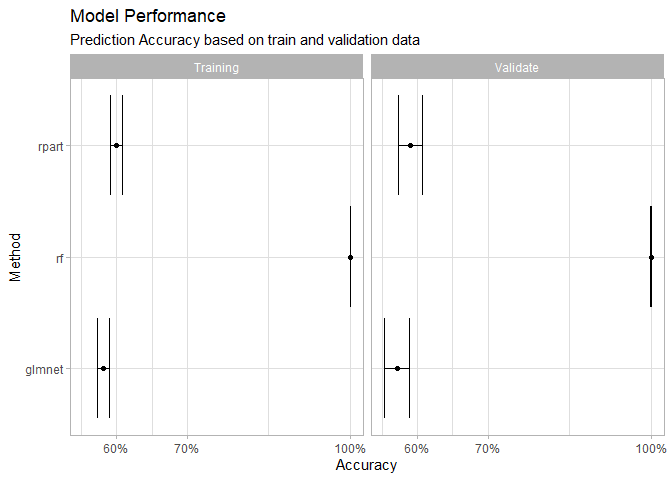
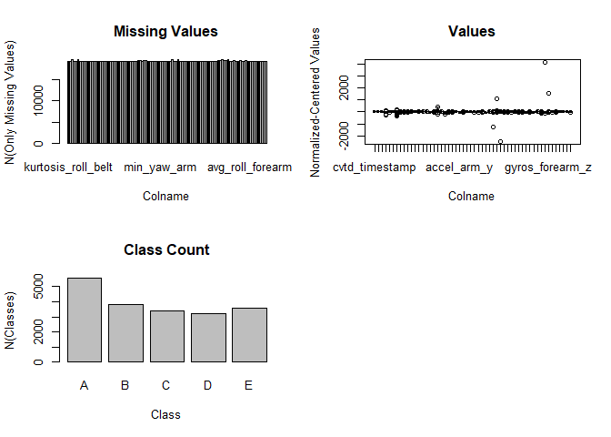
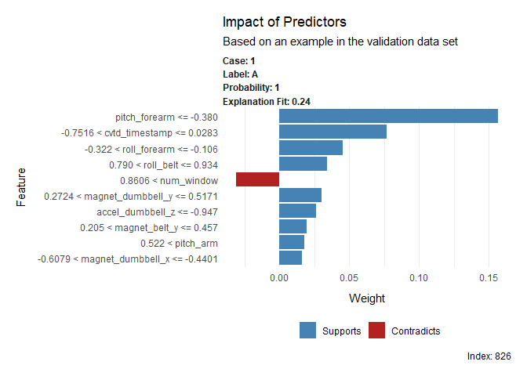

Practical Machine Learning
================
Tobias Heidler
2020-11-14

  - [Abstract](#abstract)
  - [Data Sources](#data-sources)
  - [Data Import & Transformation](#data-import-transformation)
  - [Exploratory Analysis](#exploratory-analysis)
  - [Model training](#model-training)
      - [Splitting the data](#splitting-the-data)
      - [Training](#training)
      - [Evaluation](#evaluation)
  - [Conclusion](#conclusion)
  - [Prediction on the testing data](#prediction-on-the-testing-data)
  - [Annex](#annex)
      - [Exploratory Plot](#exploratory-plot)
      - [Predictor Impact](#predictor-impact)
      - [Metrics for Random Forest](#metrics-for-random-forest)

## Abstract

In this analysis we try to predict the manner in which people exercise
based on accelerometers on the belt, forearm, arm, and dumbell of 6
participants from the Weight Lifting Exercise Dataset using different
machine learning algorithms.

Six participants were asked to perform barbell lifts correcty and
incorrectly in five different manners wearing fitness trackers like
Jawbone Up, Nike FuelBand, and Fitbit in this dataset. The data gained
from this devices is used to train the models.

*If you want to run this analysis from this Markdown document please
make sure to have pml-testing.csv and pml-training.csv in the root
directory of this document. Furthermore the models trained by this
notebook will be saved in the root directory.*

## Data Sources

The following datasets will be used:

  - [Training](https://d396qusza40orc.cloudfront.net/predmachlearn/pml-training.csv)
  - [Testing](https://d396qusza40orc.cloudfront.net/predmachlearn/pml-testing.csv)
  - [More Information](http://groupware.les.inf.puc-rio.br/har)

## Data Import & Transformation

Import libraries and the data set. The variables `raw_timestamp_part_1`
and `raw_timestamp_part_2` were combined to a more precise
`cvtd_timestamp` giving microseconds accuracy.

`new_window` and columns with a high number of missing values were
dropped. These values contain summary statistics like maximum, minimum
and sd of numeric variables within each time window, but these are not
available in most of the testing data and cannot be inferred by the
testing data set alone. Thus these values were dropped, even though they
could be useful for this classification task in a real world setting.

``` r
options(tidyverse.quiet = TRUE)


suppressPackageStartupMessages({
  suppressMessages({
    library(tidyverse)
    library(lubridate)
    library(caret)
    library(doParallel)
    library(lime)
  })
})  

theme_set(theme_light())

# Load Data
suppressWarnings({
pml_training <- readr::read_csv("pml-training.csv", 
                                na=c("", "#DIV/0!", "NA"), 
                                progress = F,
                                col_types = cols())

pml_testing  <- readr::read_csv("pml-testing.csv",
                                na=c("", "#DIV/0!", "NA"), 
                                progress = F,
                                col_types = cols())})

# Collect Informations
missingValues <- sapply(pml_training, function(x) sum(is.na(x)))
missingValues <- missingValues[missingValues>0]
userNames <- unique(pml_training$user_name)

# Prepare Data
prepare <- function(x,.train=T) {
  x$cvtd_timestamp <- x$raw_timestamp_part_1 +  x$raw_timestamp_part_2/1000000
  x$raw_timestamp_part_1 <- NULL
  x$raw_timestamp_part_2 <- NULL
  x$X1 <- NULL
  if(.train)
    x$classe <- as.factor(x$classe)
  x$user_name <- factor(x$user_name,userNames)
  x$new_window <- NULL
  x %>% select(-matches(names(missingValues)))
} 

pml_training <- prepare(pml_training)
pml_testing <- prepare(pml_testing,F)
```

## Exploratory Analysis

As seen in the first exploratory plot in the annex section there are
many missing values which we will exclude in the upcoming analysis.
Furthermore the data shows a huge amount of variability that can be
dampened by centering and normalizing, though we still have some
outliers. The number of these outliers is low, so all data is used for
training the models.

## Model training

The training dataset is split into two parts, train and validate (80% :
20% Split). Crossvalidations of train will be used to detect out of
sample (OOS) errors and the validate data set to detect overfitting.
Expected OOS-error will be less than 1% in case of a good prediction
algorithm. Train will be used to train three different algorithms:

  - Classification and Regression Trees `rpart`
  - Random Forest `rf`
  - Generalized Linear Model via Penalized Maximum Likelihood for
    Multinomial Models `glmnet`

For each algorithm five different parameter sets will be tuned
automatically on a 5x5 repeated, cross-validated train data set. The
model for each algorithm with the best accuracy will be further
described.

Time to compute these models is reduced by using multithreading
(`doParallel` library, six threads, choose other values based on your
system) and saving the models for further computations.

### Splitting the data

``` r
# Prepare Center and Scale
prepare <- preProcess(pml_training,
                      method = c("center", "scale"))
                      
# Split Dataset
inTraining <- createDataPartition(pml_training$classe, 
                                  p = .8, 
                                  list = T)

train <- pml_training[inTraining$Resample1,] 
validate <- pml_training[-inTraining$Resample1,]

# Apply Center and Scale
train <- predict(prepare, train)
validate <- predict(prepare, validate)
test <- predict(prepare, pml_testing)

# Crossfold Validation x5
fitControl <- trainControl(method = "repeatedcv",
                           number = 5,
                           repeats = 5,
                           savePredictions=TRUE,
                           classProbs=TRUE)
```

### Training

``` r
# Prepare Parallel Computing
cl <- makePSOCKcluster(6)
registerDoParallel(cl)

set.seed(825)

# Model training
if(!file.exists("model_rpartFit.rda")) {
  rpartFit <- train(classe ~ ., 
                       data = train, 
                       method = 'rpart',
                       trControl = fitControl,
                       metric = 'Accuracy',
                       tuneLength  = 6)
  save(rpartFit, file="model_rpartFit.rda") 
}

if(!file.exists("model_rfFit.rda")) {
  rfFit <- train(classe ~ ., 
                 data = train, 
                 method = 'rf',
                 trControl = fitControl,
                 metric = 'Accuracy',
                 tuneLength  = 6)
  save(rfFit, file="model_rfFit.rda")
}

if(!file.exists("model_glmnet.rda")) {
  glmFit <- train(classe ~ ., 
                 data = train, 
                 method = "glmnet",
                 trControl = fitControl,
                 metric = 'Accuracy',
                 tuneLength  = 6, 
                 family = "multinomial", 
                 type.multinomial = "grouped")
  save(glmFit, file="model_glmnet.rda")
}
                  
stopCluster(cl)
```

### Evaluation

``` r
getEvaluationData <- function(model, name, data) {
    tibble(Method = model$method,
           Dataset = name,
           broom::tidy(confusionMatrix( data=predict(model, data), 
                                        reference=data$classe)))
}

load("model_rpartFit.rda")
load("model_rfFit.rda")
load("model_glmnet.rda")

performance <- tibble() %>% 
                bind_rows(getEvaluationData(rpartFit, "Training", train),
                          getEvaluationData(rpartFit, "Validate", validate),
                          getEvaluationData(rfFit, "Training", train),
                          getEvaluationData(rfFit, "Validate", validate),
                          getEvaluationData(glmFit, "Training", train),
                          getEvaluationData(glmFit, "Validate", validate))

ggplot(performance %>% filter(term == "accuracy"),
       aes(x=estimate,
           xmin=conf.low,
           xmax=conf.high,
           y=Method)) +
  geom_errorbar() +
  geom_point() +
  facet_wrap(.~Dataset) +
  xlab("Accuracy") +
  scale_x_continuous(labels=scales::label_percent(accuracy = 1),
                     trans="log10") +
  labs(title="Model Performance",
       subtitle = "Prediction Accuracy based on train and validation data")
```

<!-- -->

## Conclusion

The overall performance of `rf` is superior compared to the other two
models, `rpart` and `glmnet`, on the training and validation dataset.
Overall the accuracy of `rpart` and `glmnet` is lower than I expected.
Performance of the `glmnet` could be further improved by choosing higher
`lambda`-values. Lower `lambda`-values provoke a warning message that no
convergence can be found after the maximum amount of iterations. Both
models could improve by choosing a better parameter set.

The performance of all models is is a bit lower on the validation data,
but overall near the accuracy of the training data implying a low OOS,
which is less than 1 % according to the model metrics for `rf` (0.08%,
see: Metrics for Random Forest), and rejecting an overfitting of the
train data split as seen in the validation data prediction accuracy.
This low OOS-error is as expected. Though I suspect, given extremly high
accuracy of the `rf` model, that this model would perform poorly in a
real world setting with other participiants and other measuring devices.
A problem known for machine learning. This is further described in [this
paper](https://arxiv.org/abs/2011.03395) for example.

This could be avoided by removing predictors that are highly specific to
this data set, like the `user_name`, `num_window` or `cvtd_timestamp`
and aquiring a much bigger data set with more devices and more diverse
users. `cvtd_timestamp` seems to have a reasonable high impact on the
prediction but has no impact in a real world setting (see: Predictor
Impact in the Annex).

Given the near perfect accuracy of the `rf` model on the validation
dataset no further modeling techniques like ensemble models or further
parameter tuning is performed and this model is choosen for predicting
the testing data set.

## Prediction on the testing data

``` r
tibble(N = 1:nrow(test), 
       Classe=predict(rfFit, test))
```

    ## # A tibble: 20 x 2
    ##        N Classe
    ##    <int> <fct> 
    ##  1     1 B     
    ##  2     2 A     
    ##  3     3 B     
    ##  4     4 A     
    ##  5     5 A     
    ##  6     6 E     
    ##  7     7 D     
    ##  8     8 B     
    ##  9     9 A     
    ## 10    10 A     
    ## 11    11 B     
    ## 12    12 C     
    ## 13    13 B     
    ## 14    14 A     
    ## 15    15 E     
    ## 16    16 E     
    ## 17    17 A     
    ## 18    18 B     
    ## 19    19 B     
    ## 20    20 B

## Annex

### Exploratory Plot

``` r
# Detect missing value fields

nClasses <- pml_training %>% count(classe)

par(mfrow=c(2,2))
barplot(missingValues, ylab="N(Only Missing Values)", xlab="Colname", main="Missing Values")
boxplot(sapply(pml_training %>% 
                 select_if(is.numeric), 
               function(x) (x - sd(x)) / (mean(x))),
        ylab="Normalized-Centered Values", xlab="Colname", main="Values")
barplot(n ~ classe, data=nClasses, ylab="N(Classes)", xlab="Class", main="Class Count")
```

<!-- -->

### Predictor Impact

``` r
samples <- c(826, 1870, 2215, 3068, 3759)
explainer <- lime(train, rfFit)
explanation <- explain(validate[c(samples[1]),], explainer, n_labels = 1, n_features = 10)
plot_features(explanation) +
  labs(title="Impact of Predictors",
       subtitle="Based on an example in the validation data set",
       caption="Index: 826")
```

<!-- -->

### Metrics for Random Forest

``` r
rfFit$finalModel
```

    ## 
    ## Call:
    ##  randomForest(x = x, y = y, mtry = param$mtry) 
    ##                Type of random forest: classification
    ##                      Number of trees: 500
    ## No. of variables tried at each split: 24
    ## 
    ##         OOB estimate of  error rate: 0.08%
    ## Confusion matrix:
    ##      A    B    C    D    E  class.error
    ## A 4464    0    0    0    0 0.0000000000
    ## B    2 3035    1    0    0 0.0009874918
    ## C    0    2 2735    1    0 0.0010956903
    ## D    0    0    2 2569    2 0.0015546055
    ## E    0    0    0    3 2883 0.0010395010
